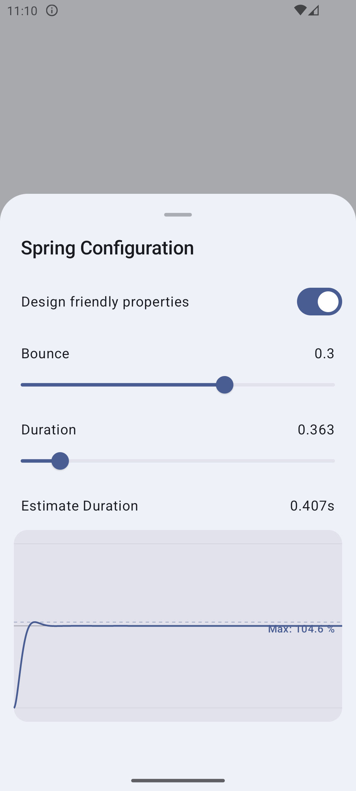
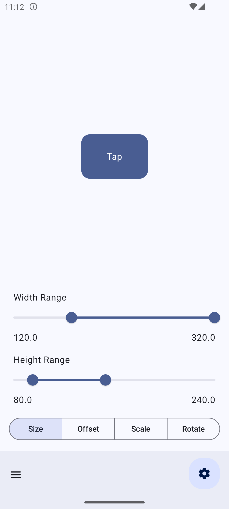
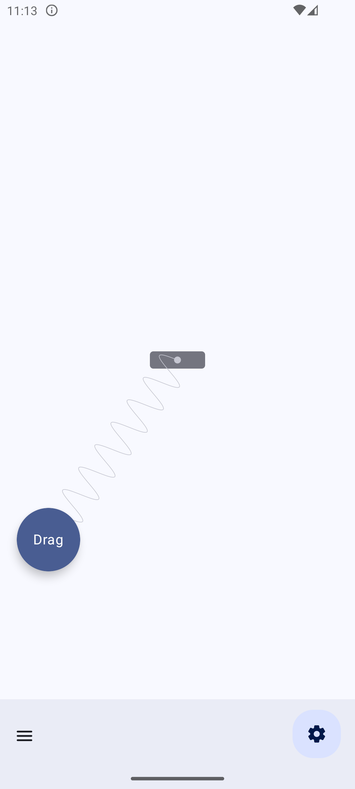
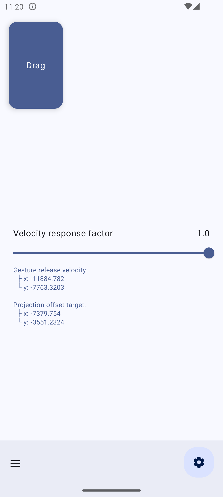
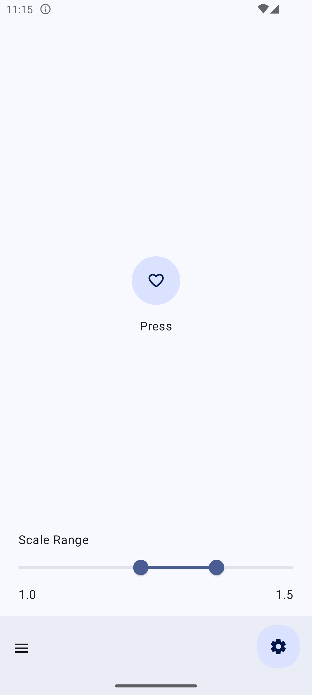
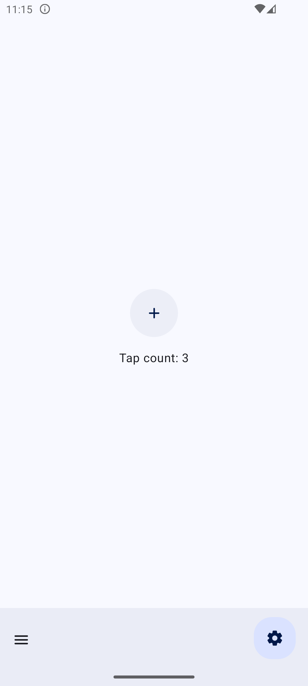

# Motion Playground Compose

This repository is my practice project for learning the Android Jetpack Compose UI framework. Some of the demo inspirations come from [fluid-interfaces](https://github.com/nathangitter/fluid-interfaces)

## 💻 Requirements

To try out this demo, you need to use [Android Studio](https://developer.android.com/studio).

## 🧩 Composable

### SpringConfiguration

Used to configure spring animation properties, it supports:

- Switchable properties that are friendly to designers (WWDC23)
- Real-time visual spring dynamics chart
- Estimate duration estimation without considering the impact of gesture velocity




### SpringAnimationPlayground

A playground driven by spring effects with some common animation properties.



### SpringDynamics

Simulating the physical properties of spring dynamics by connecting the origin and interactive objects with a fake spring.



### DraggableFloatWindow

By tracking the velocity of user gestures when releasing the Draggable Float Window, project the target position and then constrain it to both sides of the screen.



### PopToggleButton

Trigger event changes when using animation process.



### InstantResponseButton

Instantly change the color to indicate immediate response to user actions when the gesture is pressed, and use fading color changes when released.



## License

```
Copyright 2023 Xiaolin Li

Licensed under the Apache License, Version 2.0 (the "License");
you may not use this file except in compliance with the License.
You may obtain a copy of the License at

    https://www.apache.org/licenses/LICENSE-2.0

Unless required by applicable law or agreed to in writing, software
distributed under the License is distributed on an "AS IS" BASIS,
WITHOUT WARRANTIES OR CONDITIONS OF ANY KIND, either express or implied.
See the License for the specific language governing permissions and
limitations under the License.
```
